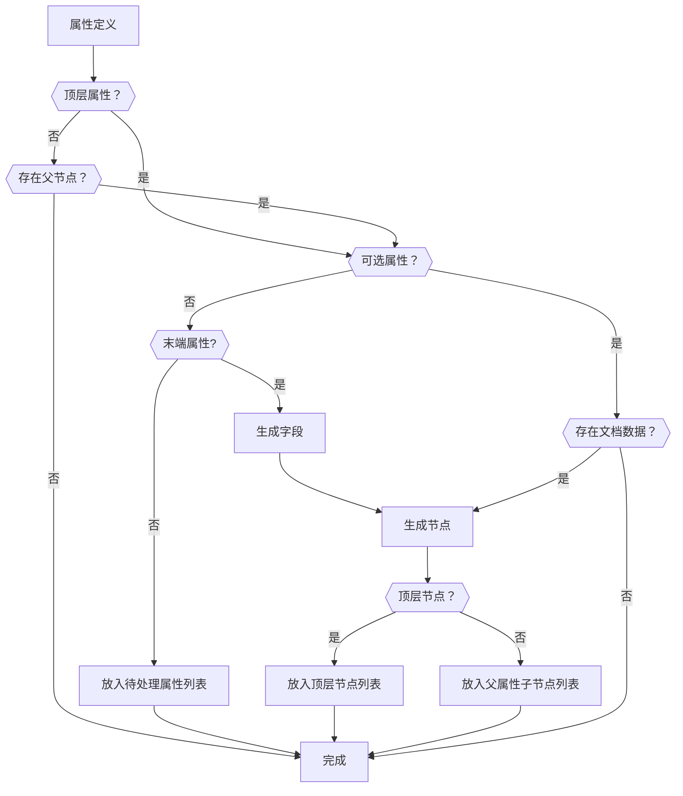
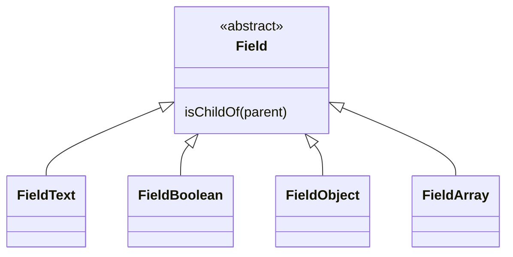
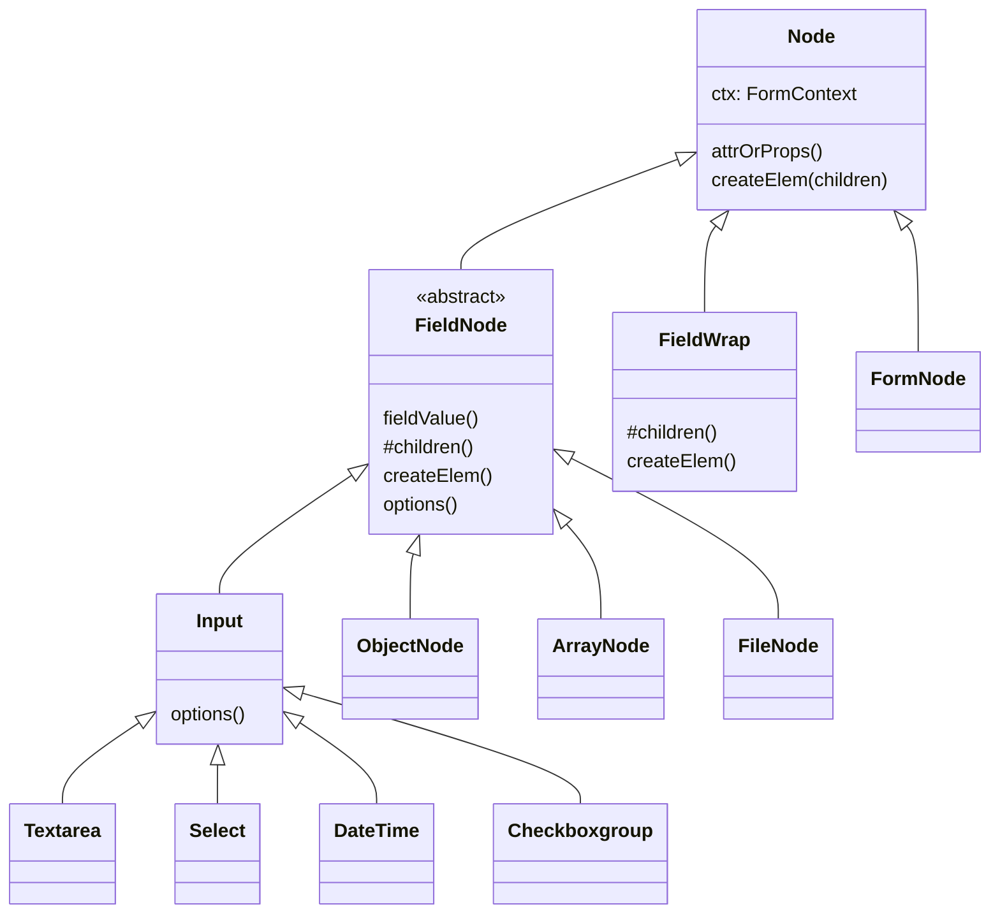
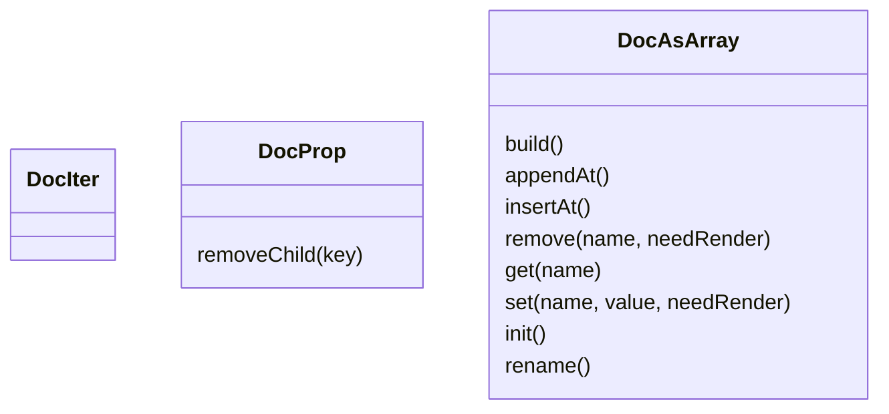

根据指定`JSONSchema`生成表单，将表单和数据绑定。

`JSONSchema`支持 8 种（"null", "boolean", "object", "array", "number", "integer", "string", "json"）基本的属性类型，每个属性和特定输入控件对应。

`object`和`array`分为固定和自由两种情况。

除了基本属性类型，还包括元数据（title,description,error）和操作(submit)。

`schema`中的 `attrs`会作为`field`的初始值。

`items`是`{value,label}`的数组。

schema（定义）->field（字段）->vnode（节点）->form（表单）

# schema

| 属性        | 说明       | 是否必填 |
| ----------- | ---------- | -------- |
| type        | 类型       | 是       |
| title       | 标签名     | 否       |
| description | 描述       | 否       |
| required    | 是否必填   | 否       |
| value       | 默认值     | 否       |
| component   | 指定的组件 | 否       |

# parse 阶段

schema->field

field 是嵌套的关系
next 节点
\$开头的属性不显示

## field.name

## field.type

schema.type 有 6 种有效的 type，需要设置成对应的 field.type

`parser`将 schema 转换成输入控件，对应关系如下：

| schema  | 属性         | field    | 初始值                  |
| ------- | ------------ | -------- | ----------------------- |
| boolean | -            | checkbox | schema.checked 或 false |
| integer |              | number   |                         |
| number  |              |          | number                  |
| string  |              | text     |                         |
| string  | format=email | email    |                         |
| string  | format=uri   | url      |                         |
| string  | format=regex | text     |                         |
| enum    |              | select   |                         |
| oneOf   |              | radio    |                         |
| anyOf   |              | checkbox |                         |
| json    |              | textarea |                         |

## field.value

初始化 model 的值

`schema.defalut`或者`schema.attrs.value`

| 类型    | 初始值 |     |
| ------- | ------ | --- |
| boolean | false  |     |
| integer | 0      |     |
| number  | 0      |     |
| string  | ''     |     |
| object  | {}     |     |
| array   | []     |     |
| json    |        |     |

# render 阶段

替换默认组件

以最简单的 string 为例。

string => input

```js
const options = { on: { input: () => {}, change: this.changed } } // this是json-doc组件
createElement('input', options)
```

如果需要，用`label`包裹`input`。

```js
labelNodes.push(inputElement)
```

添加到组件列表中

```js
formControlsNodes.push(inputElement)
```

如果需要添加描述信息

```js
formControlsNodes.push(createElement('br'))
formControlsNodes.push(createElement('small', field.description))
```

创建 form

```js
createElement(components.form.tag, {}, allFormNodes)
```

form 被包裹在 div 中

每个输入字段

```js
return createElement('div', nodes)
```

```html
<div>
  <!-- schema.title -->
  <h1></h1>
  <!-- schema.description -->
  <p></p>
  <!-- error -->
  <div></div>
  <!--表单-->
  <form>
    <!-- 可选，嵌套表单有效-->
    <div class="sub-title"></div>
    <!-- 可选，嵌套表单有效-->
    <div class="sub">
      <!-- wrappingClass 可选 -->
      <div>
        <!-- label可选 -->
        <label>
          <!-- 可选 -->
          <span data-required-field="true/false">label的值</span>
          <input />
          <!--下面连个可选，如果属性有描述-->
          <br />
          <small></small>
        </label>
      </div>
    </div>
    <!--表单按钮-->
    <buttons></buttons>
  </form>
</div>
```

对象

对象指定了名字`name`，和属性`key`不一样

fields 是嵌套的

如果指定了 name 就不是按照层级关系，会和 root 并列，不影响数据对象的命名，也不影响显示顺序

通过 default 指定默认值

formNode.root

formNode.指定的名字

发生在对象属性的循环里

记在根 fields 里，还是一个 name 命名的子 fields 里

添加 sub-title 用 sub 把每一个 form 包起来

参考：https://json-schema.org/draft/2019-09/json-schema-validation.html

在 parse 阶段完成数据的初始化？

# 错误处理

# 布局问题

提交和重置按钮

错误提示

嵌套

通过折叠面板解决

动态增减项

如何表示必选

creator

creator.render

支持 doc 瘦身

支持定制内置操作的名称，例如：上传文件，参考模板等。

支持给对象添加动态属性

# 构造过程



构造的过程就是根据`schema`和`doc`为渲染函数（`render`）准备节点的过程。属性可以分为**固定的**和**可选的**两类。固定属性的节点是否存在与文档数据无关，反之，可选属性的节点是否存在与文档数据有关。数组属性通过`items`定义的子属性是可选的，`items`定义的子`schema`生成多少个（组）节点由文档中对应的数组数据决定。对象属性通过`patternProperties`定义的子属性是可选的，生成多少个（组）节点由文档中对应的对象数据决定。

目前，文档的**根**必须为对象，不支持数组。

如果属性的父级属性没有生成节点，那么也不需要给属性生成节点。属性可以分为**定义层级关系的**和**定义用户输入的**两类。**定义用户输入的**是末端节点，它不会有子节点（下拉框，单选框，多选空的选项生成的子节点被认为是输入属性节点的一部分）。**层级关系属性**生成节点时，需要等待它的下级节点都生成完，因此，在构造过程中需要记录正在处理的层级属性。`JSONSchema`不限制层级深度，构造过程中会出现嵌套等待子节点生成的情况，因此，当层级关系属性的子节点都具备生成层级节点后，还需要检查改节点是否为层级属性的子节点，如果是应该放入父属性的子节点列表。

如果属性是**可选的**，那么要检查文档中是否已经存在和属性对应数据，如果有，根据数据和属性定义生成节点。可选属性带来的问题是，属性和节点是一对多的关系，例如：数组属性数据中的子项目由`items`定义，只有 1 份，但是生成的数据项的数量是任意的。（property 不变，field 实例化，动态的 name，动态的 index。field 是 prop 的实例，在构造过程中，prop 是固定的不变的，field 根据 prop 和 doc 生成。field 记录 prop 和 doc 之间的关联，为 node 准备数据。）

父节点是可选属性，有数据，子属性是固定属性应该生成。

如果属性不是文档的顶层节点，那么它的父节点还未生成节点，因此需要将生成的节点放入父属性已生成的子节点列表中。

1 个可选属性根据文档数据可能生成多个字段。如果可选属性是层级关系熟悉，它还会有子属性，子属性的定义只有一份，如何给每个父节点生成节点。

构造过程的主干是对`schema`的深度遍历。`schema`上的每个节点只访问 1 次。处理每个属性时，需要生成它对应的所有字段。假如有可选属性 P，根据文档数据生成了字段，F1，F2 和 F3，属性有子属性 CP，那么处理 CP 时，需要给 F1，F2 和 F3 分别生成 CF1，CF2 和 CF3。

属性生成字段

数组中的简单类型生成属性

对象下的属性和数组下的 items 有什么区别？

如果是数组下的简单类型，属性没有名字，items 中的就是用户输入属性。

如果是数组，items 是简单类型，作为用户输入字段？

属性、字段和节点之间的关系。

属性是对文档对象的层级结构和用户输入的定义。

对象 1 个字段 子属性 固定+可选

数组 1 个字段 项目是简单类型时，不会作为属性输出 可选

生成几个字段？父字段的数量和文档数据。

数组的项目是对象，有多个项目，处理对象的字段时需要生成多个。

items 的内容作为数组属性的直接定义信息而不是子属性。

属性和字段命名规则

每个属性（定义）都有一个唯一的名字。

属性的`fullname`由`JSONSchema`定义和文档数据无关。数组类型属性通过`items`指定数组中项目的定义，这个定义的名称固定为`[*]`，代表数组中的项目（与`json-path`一致）。

字段的`fullname`与文档中的数据一致。如果生成字段的属性是固定属性，那么字段的`fullname`与属性的`fullname`一致。产生可选属性有两种可能：1、数组类型的属性下的`item`定义的属性都是可选属性，字段的`fullname`中数组索引号是动态的；2、对象类型属性下用`patternProperties`定义的子属性，它的名字可以由用户定义。

字段的名称应该为：父字段的全程+字段的名称。

如何判断属性匹配的父字段。子属性匹配父属性。

属性的 path，和父属性 fullname 相等。

堆栈中字段的顺序？

关于数组项目定义字段的索引值

属性和字段命名问题

支持添加可选属性，修改属性名

如果定义了多种规则，确定添加的新字段对应哪个规则？必须由用户选择？

修改属性，如何能保持属性在对象中的顺序？

修改属性的名称，为了保证顺序，需要把整个父对象重构。

把文档对象扁平化是不是更好的方法？

叶节点是按照正序处理，加入到父节点的；连接节点按正序入栈，按逆序出栈。父节点的子节点叶节点和连结节点是混合的。

现在的子节点数组有问题，如果 leaf1 和 leaf2 之间有连接节点，怎样才能知道插入位置？

解决的方案是应该深度遍历到头，就收缩一次

每个属性的处理都会找父字段，如果是叶节点加入到对应的父节点的子节点中，如果是连接节点就放在堆栈中。

所有的连接节点都是在收缩推展的过程中加入父字段。

固定结构

数组

对象支持自定义属性

文件类型

修改属性名称后如何保持顺序不发生变化

如果一个对象下有多种类型，怎么知道要添加的是哪种类型？

editDoc 中不符合 schema 的数据是否要去掉？

连接属性的 value 记录的只是初始值

json 数据的录入过程

每次 render 都是全量构造组件的过程。

field 的状态需要缓存下来，

# 数组

如果数组项目的类型是简单类型，直接节点，不再生成字段

# 文件

## 定义

文件要放在数组类型的字段中，该字段的数组项目的类型为`object`，`format=file`。数组项目对象通常包含`name`和`url`两个属性。

## 文档

# 代码

## 字段包裹

div.tvu-jdoc**field
--label.tvu-jdoc**field-label
--div.tvu-jdoc\_\_field-fullname
--
--div.tvu-jdoc\_\_field-desc
--div.tvu-jdoc\_\_field-actions

# 类

## 表单字段类图



## 表单节点类图



## 文档类



# 当前正在编辑的节点

叶子节点获取输入焦点时，通知父节点获取输入焦点。

父节点决定是否生成获取输入焦点事件并继续通知上级节点。

组件外部要能够获取当前获取数据焦点的路径。

`tvu-focus`
